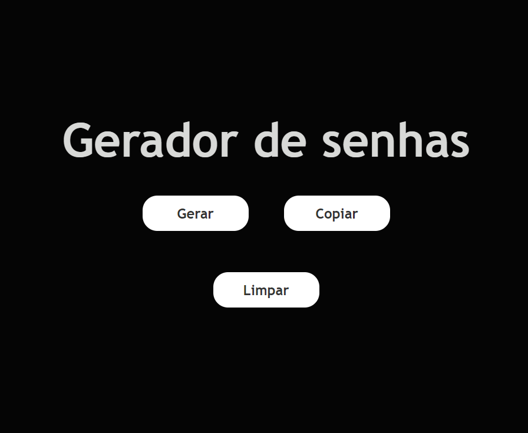
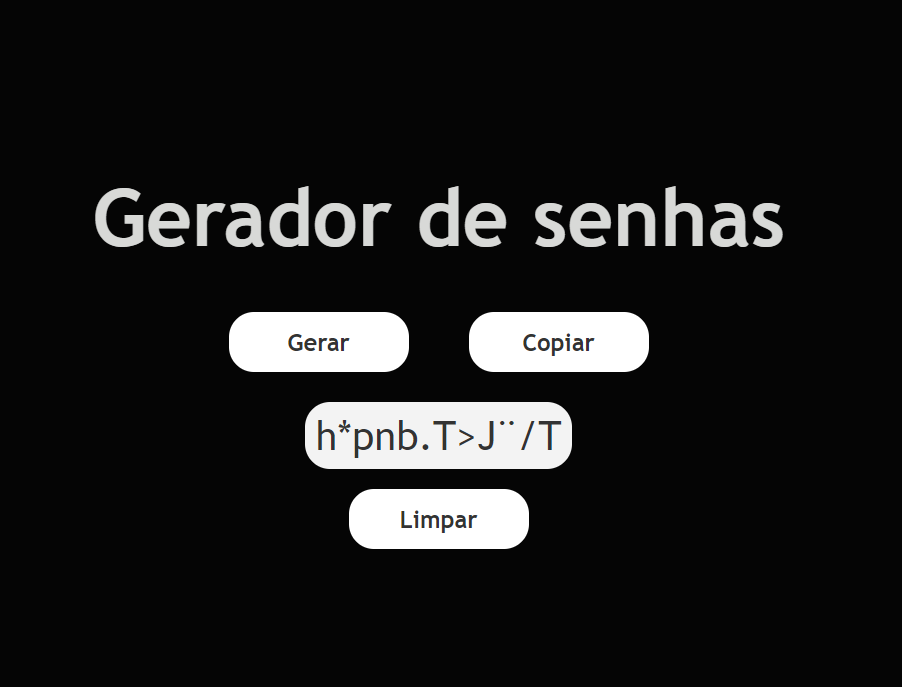
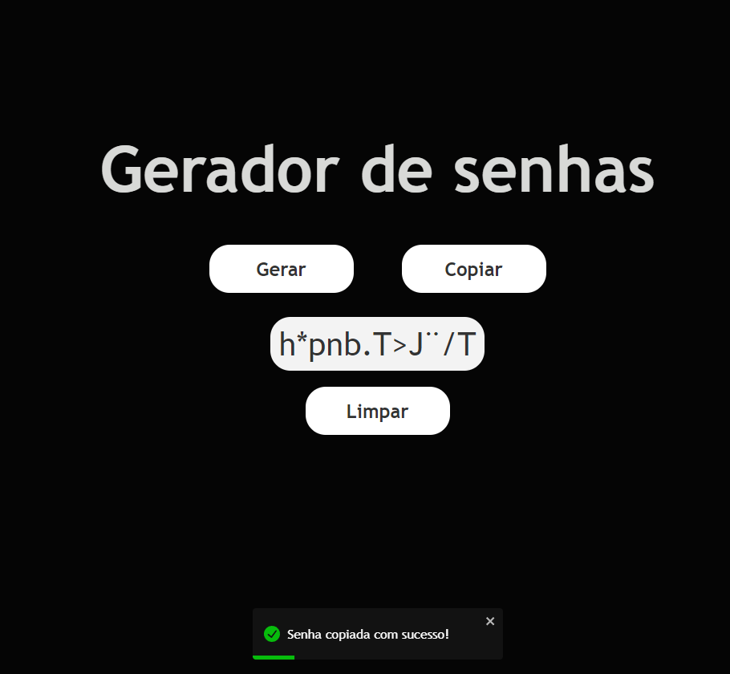
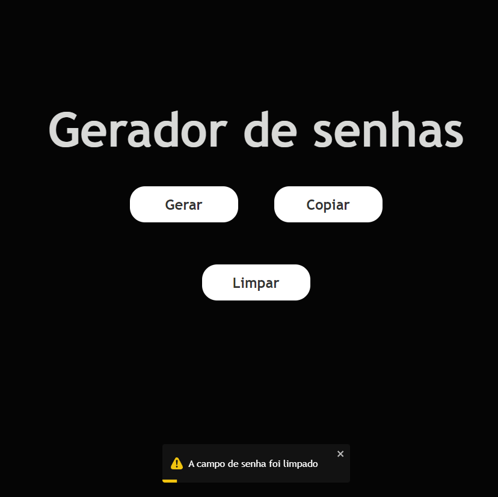

## Gerador de senhas

O projeto realizado em React.JS tem como objetivo criar senhas com até 12 caracteres de forma automatica, foram inseridos notificações para botoões de copias e de limpar senha.

## Projeto

Tela incial

Senha gerada

Senha copiada

Senha apagada

## Funcionalidades

- Gera senhas aleatorias com 12 caracteres.
- Copia as senhas geradas
- Limpa o campo de senhas geradas

## Melhorias

- Validação para não repetir o mesmo caracter.

## Autor

- JuanFila (https://github.com/JuanFila)

  Meu linkedin: https://www.linkedin.com/in/juan-pablo-fila-7801481a1/